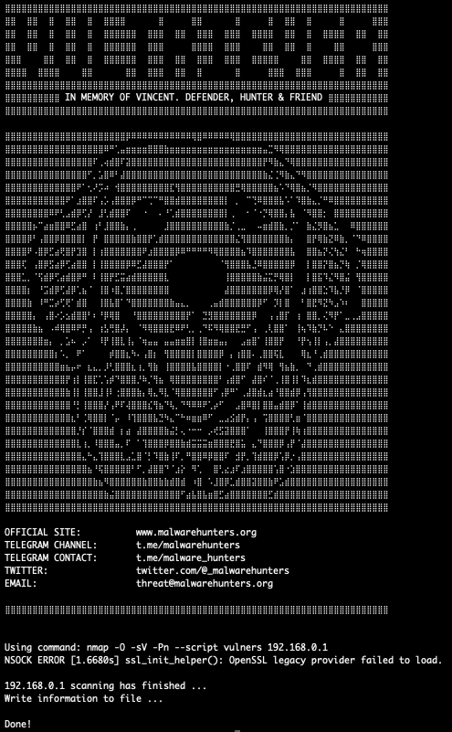
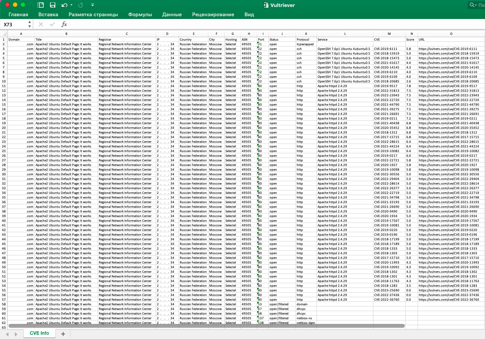

# Vultriever - Vulnerability scoring with Nmap and theHarvester

Vultriever - utility that allows to convert to Excel and JSON formats the results of using the Nmap and theHarvester scanners in conjunction with the built-in Vulners snap-in. It was created to automate the process of inventory of digital infrastructure, open ports and running network services on the servers and scoring of existing vulnerabilities determined based on the versions of the software used. Implemented the use of Vultriever from the terminal and as an imported module in native Python scripts. 

In the process, Vultriever collects and provides the following information about the server in a structured form:
<ul>
<li>Server IP address</li>
<li>Server location country</li>
<li>Server location city</li>
<li>Server hosting</li>
<li>Autonomous system number (ASN)</li>
<li>Network port number</li>
<li>Network port status</li>
<li>Protocol used by the network port</li>
<li>Network service operating on the network port and its version</li>
<li>Vulnerability CVE-identifier</li>
<li>Vulnerability rating</li>
<li>URL-link to the description of the vulnerability on the platform Vulners.com</li>
<li>Domain</li>
<li>Domain registrar</li>
<li>Domain title</li>
</ul>

VULTRIEVER uses the standard command syntax for Nmap scanner (need to install) and several unique parameters:

    -CVE    Activate a vulnerability checker that defines a CVE identifier, 
            score and description of a well-known vulnerabilities for each detected service
    
    -HARV   Activate the use of Harvester (need to install) utility to detect subdomains of target 
            resources and their subsequent analysis in accordance with the specified parameters

    -RES    Activate the module for collecting additional information about the infrastructure: 
            countries, cities, hosting services, autonomous systems number of target servers
            and registrars of target domains
    
    -TITLE  Activate the target resources titles collection module    

VULTRIEVER usage in TERMINAL: 

    # sudo python vultriever.py <Nmap arguments string>
    
    # sudo python vultriever.py x.x.x.x y.y.y.y z.z.z.z/24 -sS -sU --top-ports 100 -Pn -CVE -HARV -RES -TITLE
    # sudo python vultriever.py domain1.com domain2.com -sS -sU --top-ports 100 -Pn -CVE -HARV -RES -TITLE
    # sudo python vultriever.py x.x.x.x domain1.com z.z.z.z/24 -sS -sU --top-ports 100 -Pn -CVE -HARV -RES -TITLE
    # sudo python vultriever.py -iL targets.txt -sS -sU --top-ports 100 -Pn -CVE -HARV -RES -TITLE
    
Input targets list format:
    
        _______________
        |x.x.x.x      |
        |y.y.y.y      |
        |             |
        |. . . .      |
        |             |
        |z.z.z.z/24   |
        |domain1.com  |
        |             |
        |. . . .      |
        |             |
        |domain100.com|
        ---------------



The results of the analysis are stored in a structured form in Excel file



VULTRIEVER usage in PYTHON CODE:    

    vultriever(['<target>', ... , '<target>'], '<Nmap arguments string>')

    ----------------- PYTHON SCRIPT -----------------
    
    from vultriever import vultriever

    analysis_json = vultriever(['x.x.x.x', 'y.y.y.y', 'z.z.z.z/24'], '-sS -sU --top-ports 100 -Pn -CVE -HARV -RES -TITLE')
    analysis_json = vultriever(['domain1.com', 'domain2.com'], '-sS -sU --top-ports 100 -Pn -CVE -HARV -RES -TITLE')
    analysis_json = vultriever(['x.x.x.x', 'domain1.com', 'z.z.z.z/24'], '-sS -sU --top-ports 100 -Pn -CVE -HARV -RES -TITLE')
    
    -------------------------------------------------

vultriever() function returns information in JSON format with next structure:

    {
        "ip_address" : "x.x.x.x",
        "country": "United States",
        "city": "San Francisco",
        "hosting": "Cloudflare, Inc.",
        "asn": "13335",
        
        "domain": "domain.com",
        "title": "Target Domain",
        "registrar": "Regional Network Information Center, JSC dba RU-CENTER",

        "ports" : [
            
                {
                    "number" : 26,
                    "status" : "open",
                    "protocol" : "smtp",
                    "service" : "Eximsmtpd4.95",
                    "vulnerabilities" : [
                        
                                {
                                    "cve" : "CVE-2022-37452",
                                    "score" : "9.8",
                                    "url" : "https://vulners.com/cve/CVE-2022-37452"
                                }
                        
                    ]
                    
                }
            
        ]
    }

Incorrect request will result to 'error_message' in JSON response keys
    
    {
        
        "error_message" : <error message>
        
    }
    
## Requirements

<ul>
<li>Nmap</li>
<li>theHarvester</li>
<li>openpyxl python module</li>
</ul>